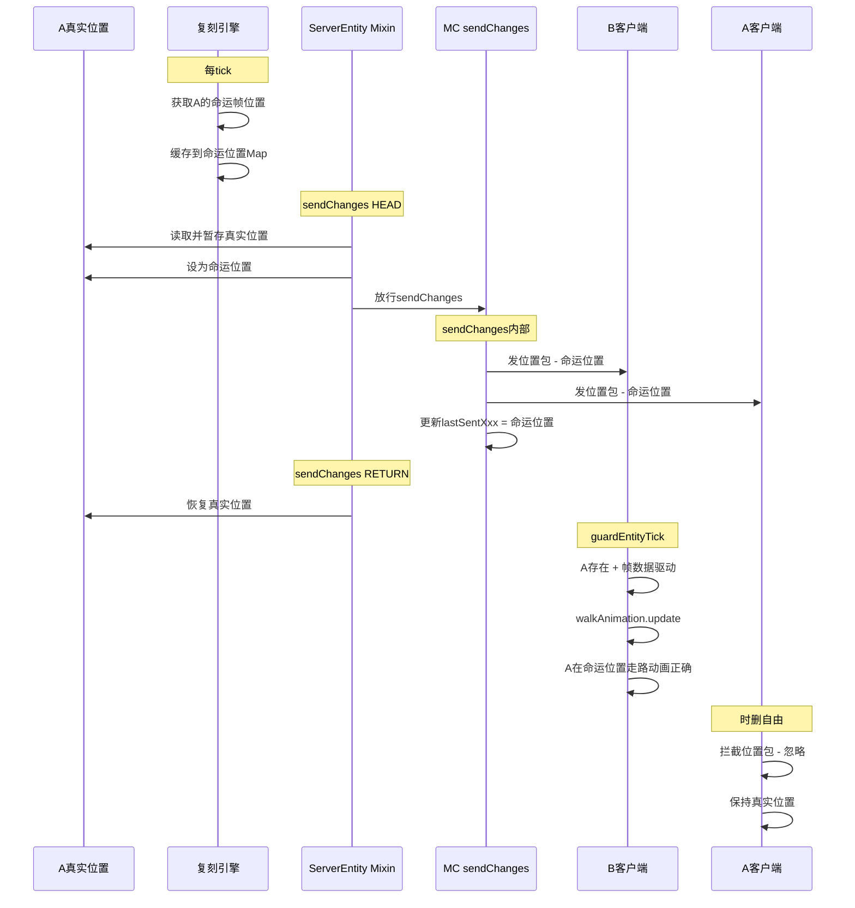
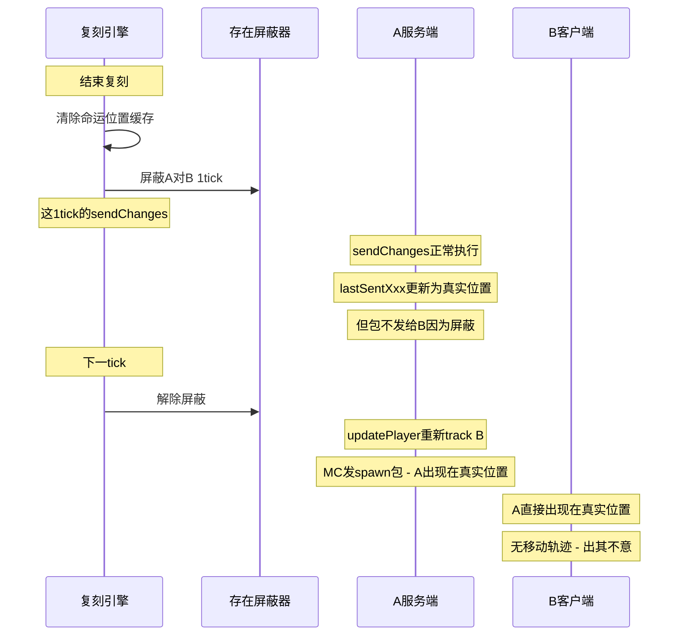

# 时删多人表现修复方案

## 问题概述

时间删除期间存在3个多人可见性问题：
1. **B完全看不到A** — tracker层屏蔽导致A在B的ClientLevel中被despawn
2. **动画缺失/滑行** — B看到的A移动时没有走路动画
3. **传送轨迹可见** — 时删结束时B看到A从命运位置传送到真实位置

## 根因分析

### 问题1：B看不到A

```
时间线：
1. 进入时删 → 存在屏蔽器.屏蔽除外(A, "epitaph", A)
2. EpitaphExistenceBlockerTrackMixin.updatePlayer(B)
   → 是否屏蔽(A, B) = true
   → seenBy.remove(B) → serverEntity.removePairing(B)
   → B的客户端收到despawn包 → A从B的ClientLevel消失
3. 帧同步包到达B → 当前帧表包含A的帧数据
4. EpitaphReplayClientLevelMixin.guardEntityTick:
   → 遍历Level中的实体 → A不存在 → 帧数据无处应用
```

**根因**：tracker层面将B从A的seenBy移除 → A实体从B客户端消失 → 帧数据虽然到达但找不到实体来驱动。

### 问题2：动画缺失

在之前的sendChanges cancel方案中：
- A的位置通过MC的tracker包（teleport/relative move）到达B客户端
- MC的lerp平滑移动不触发 `walkAnimation.update()` → 腿不动 → 滑行
- 帧驱动路径（`EpitaphReplayClientLevelMixin`）包含完整动画驱动，但只对「被控制实体」生效

### 问题3：传送轨迹

结束复刻时执行顺序：
1. 通知客户端 → 2. 时删结算 → 3. 释放接管 → **4. 解除存在屏蔽**
- 解除屏蔽时A在真实位置 → MC发spawn包 → B看到A出现在真实位置
- 如果A移动了很远，B会看到从命运位置突然跳到真实位置

## 修复方案：sendChanges位置欺骗

### 核心思路

**不使用tracker层面的存在屏蔽**（避免实体从B客户端消失），改用**sendChanges位置欺骗**：

1. A始终在B的seenBy中（B客户端上A的实体存在）
2. 在sendChanges执行前：暂存A的真实位置 → 设为命运位置
3. sendChanges正常执行：MC把命运位置发给所有viewer（包括B）
4. sendChanges执行后：恢复A的真实位置
5. 帧同步包继续发A的命运帧数据 → B客户端帧驱动A → 动画正确
6. A客户端收到命运位置包 → 需要忽略（时删自由状态下拦截位置包）

### 数据流（修复后）



### 结束时处理



## 详细实施步骤

### 步骤1：复刻引擎 — 添加命运位置缓存

**文件**：`src/main/java/com/v2t/puellamagi/system/ability/epitaph/复刻引擎.java`

改动：
- 添加 `static Map<UUID, 命运位置> 命运位置缓存` 
- 命运位置数据类：x, y, z, yRot, xRot, yBodyRot, yHeadRot
- 在 `驱动实体帧()` 中，当 `session.时间删除中` 时，把使用者的命运帧位置存入缓存
- 添加 `static 命运位置 获取命运位置(UUID)` 查询方法供Mixin调用
- 添加 `static boolean 是否时删位置欺骗中(UUID)` 查询方法

### 步骤2：复刻引擎 — 修改进入时删逻辑

**文件**：`src/main/java/com/v2t/puellamagi/system/ability/epitaph/复刻引擎.java`

改动（`进入时间删除()` 方法）：
- ~~删除~~ 保留 `存在屏蔽器.屏蔽除外()` 调用 → **改为不调用**
- 不再屏蔽A对B → A始终在B的seenBy中 → B客户端上A的实体存在

### 步骤3：EpitaphReplayServerEntityMixin — 位置欺骗

**文件**：`src/main/java/com/v2t/puellamagi/mixin/epitaph/EpitaphReplayServerEntityMixin.java`

改动：
- sendChanges HEAD注入中，增加位置欺骗逻辑：
  - 检查实体是否是时删使用者 → `复刻引擎.获取命运位置(entity.getUUID())`
  - 如果有命运位置 → 暂存真实位置到ThreadLocal → 设实体位置为命运位置
  - 不cancel sendChanges → 让MC正常执行
- 添加sendChanges RETURN注入：
  - 如果暂存了真实位置 → 恢复实体的真实位置

### 步骤4：新增客户端Mixin — 时删期间拦截本地玩家位置包

**新文件**：`src/main/java/com/v2t/puellamagi/mixin/epitaph/client/EpitaphTimeDeletionPacketMixin.java`

职责：时删自由状态下，拦截服务端发来的本地玩家位置包（防止被命运位置覆盖真实位置）

改动：
- `@Mixin(ClientPacketListener.class)`
- 拦截 `handleMoveEntity`：如果目标是本地玩家且时删自由 → cancel
- 拦截 `handleTeleportEntity`：如果目标是本地玩家且时删自由 → cancel

注册到 `mixins.puellamagi.json` 的 `client` 列表。

### 步骤5：复刻引擎 — 修改结束复刻逻辑

**文件**：`src/main/java/com/v2t/puellamagi/system/ability/epitaph/复刻引擎.java`

改动（`结束复刻内部()` 方法）：
- 清除命运位置缓存
- 时删结束时：用存在屏蔽器做1tick短暂屏蔽
  - `存在屏蔽器.屏蔽除外(userUUID, "epitaph_fadeout", userUUID)`
  - 注册一个延迟1tick的任务来解除屏蔽
  - 这1tick内sendChanges正常执行 → lastSentXxx更新为真实位置但包不发给B
  - 解除后B重新被track → MC发spawn包 → A出现在真实位置
- 不再直接调用 `存在屏蔽器.解除屏蔽(userUUID, 屏蔽来源)` 时删相关屏蔽

### 步骤6：复刻引擎 — 清除全部方法同步更新

**文件**：`src/main/java/com/v2t/puellamagi/system/ability/epitaph/复刻引擎.java`

改动：
- `清除全部()` 中清除命运位置缓存
- `玩家下线()` 中清除该玩家的命运位置缓存

### 步骤7：确认客户端帧驱动对A的处理

**文件**：`src/main/java/com/v2t/puellamagi/mixin/epitaph/client/EpitaphReplayClientLevelMixin.java`

确认：
- 时删期间A的帧数据包含在帧同步包中（`发送帧同步包给客户端()` line 732已确认）
- B客户端的 `guardEntityTick` 会检测到A被控制（帧数据在当前帧表中）
- A的实体存在于B的ClientLevel中（不被despawn了）
- 帧驱动会调用 `应用到活体()` → 包含 `walkAnimation.update()` → 动画正确

**可能需要的修改**：
- 时删自由状态下，本地玩家（A）不被帧驱动（已有 line 47判断）→ ✅ 无需修改
- 其他玩家看A时，A的帧数据需要在B客户端被标记为"被控制" → 当前帧表包含A → `实体是否被控制()` 返回true → ✅ 无需修改

## 需要修改的文件清单

| 文件 | 改动类型 | 说明 |
|------|---------|------|
| [`复刻引擎.java`](src/main/java/com/v2t/puellamagi/system/ability/epitaph/复刻引擎.java) | 修改 | 命运位置缓存 + 进入时删 + 结束时删 |
| [`EpitaphReplayServerEntityMixin.java`](src/main/java/com/v2t/puellamagi/mixin/epitaph/EpitaphReplayServerEntityMixin.java) | 修改 | sendChanges位置欺骗 |
| `EpitaphTimeDeletionPacketMixin.java` | 新增 | 客户端拦截本地玩家位置包 |
| [`mixins.puellamagi.json`](src/main/resources/mixins.puellamagi.json) | 修改 | 注册新Mixin |

**不需要修改的文件**：
- `EpitaphExistenceBlockerTrackMixin.java` — 保留，结束时短暂屏蔽仍需要
- `存在屏蔽器.java` — 保留，结束时短暂屏蔽仍需要
- `EpitaphReplayClientLevelMixin.java` — 逻辑已覆盖，无需修改
- `客户端复刻管理器.java` — 帧接收逻辑不变
- `时间删除客户端处理器.java` — 清理逻辑不变
- `实体帧数据.java` — 应用逻辑不变

## 风险与缓解

### 风险1：位置欺骗期间碰撞检测

sendChanges在ServerEntity.sendChanges()中执行，此时服务端主线程正在运行。位置欺骗（暂存 → 设命运位置 → sendChanges → 恢复）在同一线程同步执行，不会有其他代码在这个间隙访问A的位置。

**缓解**：位置欺骗仅在sendChanges的HEAD到RETURN之间生效，整个过程同步执行，无并发风险。

### 风险2：A客户端收到命运位置包

sendChanges发的包也会到达A自己。需要在A客户端拦截。

**缓解**：新增 `EpitaphTimeDeletionPacketMixin` 在 `handleMoveEntity`/`handleTeleportEntity` 拦截。

### 风险3：1tick屏蔽导致闪烁

结束时1tick的存在屏蔽会让A从B屏幕上消失1帧。

**缓解**：
- 1帧消失（1/20秒 = 50ms）几乎不可感知
- 可以在客户端用淡出效果掩盖（后续优化）
- 比看到传送轨迹好得多
